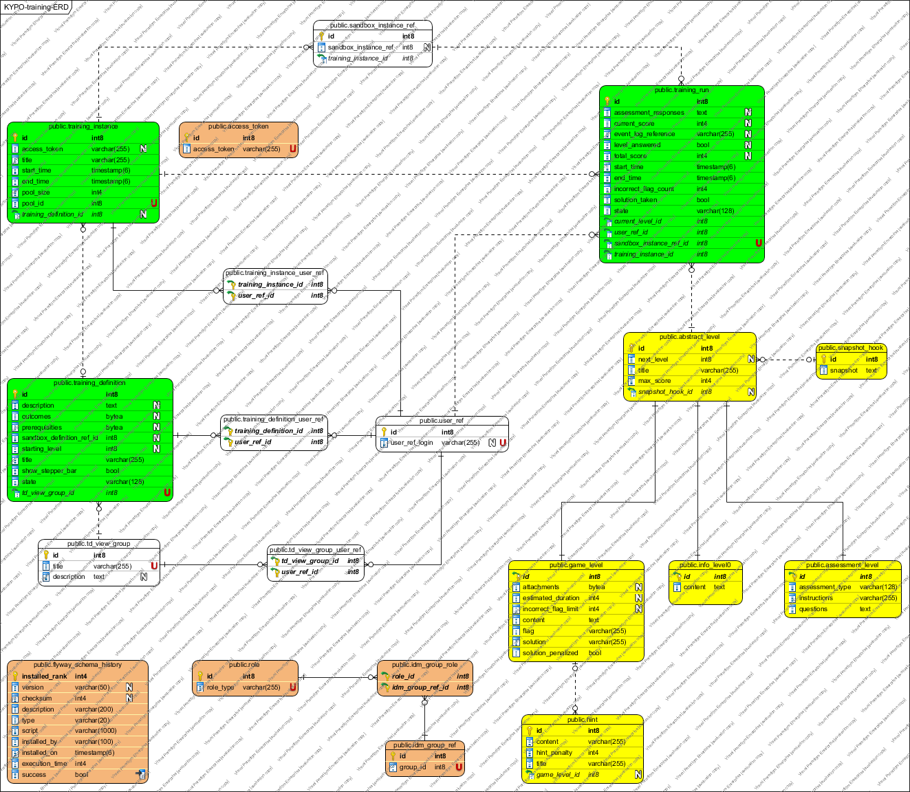

# KYPO2 Trainings
This is parent project representing back-end for Training. 

It is divided into several modules as:
* `kypo2-rest`
  * Provides REST layer for communication with front-end.
  * Based on HTTP REST without HATEOAS.
  * Documented with Swagger.
* `kypo2-facade`
  * Contains API (DTO classes)
    * These are annotated with proprietary converters for DateTime processing.
    * Localized Bean validations are set (messages are localized).
    * Annotations for Swagger documentation are included.
  * Map Entities to DTO classes and vice versa with MapStruct framework.
  * Contains @Transactional annotations.
* `kypo2-service`
    * Provides business logic of the application:
      * Calls persistence layer for database queries and combining the results as necessary.
      * Calls another microservices.
* `kypo2-persistence`
  * Provides data layer of the application (Database queries).
  * Uses Spring Data JPA (Spring wrapper layer over JPA implemented with Hibernate framework).
  * Communicates with PostgreSQL database.
  * Uses QueryDSL for filtering the data.
* `kypo2-elasticsearch`
  * Used for auditing and retrieving data from Elasticsearch storage.
  * Contains Event classes describing particular events.

And the main project (parent maven project with packaging pom):
* `kypo2-training`
  * Contains configurations for all modules as dependency versions, dependency for spring boot parent project etc.
  

## Authors

Role         | UCO          | Name 
------------ | ------------ | -------------
Lead Developer    |   441048     | Šeda Pavel
Developer    |   445537     | Dominik Pilár
Developer    |   445343     | Boris Jaduš


## Starting up Project (NOT implemented yet)
You don't have to install Java, Maven, Tomcat, Elasticsearch, etc. to your local development environment. All you need is [Vagrant installed] (http://docs.ansible.com/ansible/latest/guide_vagrant.html).

```
vagrant up
```

Now check that documentation on the following section is reachable. 
NOTE: This command will also insert some testing data to data storages.

## Documentation 
Documentation is done in the Swagger framework. It is possible to reach it on the following page:

```
~/kypo2-rest-training/api/v1/swagger-ui.html
```

e.g. on localhost it should be:

```
http://localhost:8080/kypo2-rest-training/api/v1/swagger-ui.html
```

NOTE: please note that client for that REST API could be generated using [Swagger codegen] (https://swagger.io/tools/swagger-codegen/). It is crucial to annotate each RestController method properly!

# Following steps are necessary for manual starting up project

## 1. Getting Masaryk University OpenID Connect credentials 

1. Go to `https://oidc.ics.muni.cz/oidc/` and log in.
2. Click on "**Self-service Client Registration**" -> "**New Client**".
3. Set Client name.
4. Add at least one custom Redirect URI and `http://localhost:8080/{context path from external properties file}/webjars/springfox-swagger-ui/oauth2-redirect.html` (IMPORTANT for Swagger UI).
5. In tab "**Access**":
    1. choose which information about the user you will be getting, so-called `scopes`.
    2. select just *implicit* in **Grand Types**
    3. select *token* and *code id_toke* in **Responses Types**
6. Hit **Save** button.
7. Then got to tab "**JSON**", copy the JSON file and save it to file. **IMPORTANT STEP**
8. Now create new Resource in "**Self-service Protected Resource Registration**".
9. Again insert client Name and save JSON to an external file in "**JSON**" tab.
10. In tab "**Access**" again choose which information about the user you will be getting, so-called `scopes`.
11. Hit **Save** button.


### Creating YAML file with roles 

If you want to insert initial roles to the system you have to specify them in external YAML file (e.g., roles.yml) and then insert its path to properties file which is described in next step. For each role, you only need to specify role type which will be used in your project. 
Roles are stored as a string in DB but they are rewritten to upperCase. So roles in the example below are stored as GUEST, ADMINISTRATOR and
USER.  
 
```yaml
roles:
    - ADMINISTRATOR
    - USER
    - GUEST
```

## 2. Create a property file with necessary configuration details
After step 1 you have to create properties file according to the format below and save it.
```properties

# Environment DEV or PROD
### DEV environment does not need kypo2-user-and-group project but assign authority as GUEST by default
spring.profiles.active=DEV
spring.profiles.dev.roles=ADMINISTRATOR


server.address={server address}, e.g., localhost (127.0.0.1)
server.port={port for service}, e.g., 8080
server.servlet.context-path=/{context path for service}, e.g., /kypo2-rest-training/api/v1

# calling user-and-group project
user-and-group-server.uri={URI}, e.g., http://localhost:8081/kypo2-rest-user-and-group/api/v1

# calling openstack project
openstack-server.uri={URI}, e.g., http://147.251.55.18:8081/kypo-openstack/api/v1 

# Elasticsearch
elasticsearch.ipaddress=localhost
elasticsearch.protocol=http
elasticsearch.port=9200

# OpenID Connect
kypo.idp.4oauth.introspectionURI=https://oidc.ics.muni.cz/oidc/introspect
kypo.idp.4oauth.authorizationURI=https://oidc.ics.muni.cz/oidc/authorize
kypo.idp.4oauth.resource.clientId={your client ID from Self-service protected resource}
kypo.idp.4oauth.resource.clientSecret={your client secret from Self-service protected resource}
kypo.idp.4oauth.client.clientId={your client ID from Self-service client}
kypo.idp.4oauth.scopes=openid, email
# you can add more scopes according to settings from step 1.


# spring cloud
spring.cloud.refresh.enabled = false

# DATASOURCE
spring.datasource.url=jdbc:postgresql://{url to DB}
spring.datasource.username={user in DB}
spring.datasource.password={password for user to DB}
spring.jpa.properties.hibernate.temp.use_jdbc_metadata_defaults = false
spring.jpa.database-platform=org.hibernate.dialect.PostgreSQL9Dialect
spring.jpa.hibernate.ddl-auto=validate
spring.jpa.show-sql=true
spring.jpa.properties.hibernate.format_sql=true

# FLYWAY
spring.flyway.url=jdbc:postgresql://{url to DB}
spring.flyway.user={user in DB}
spring.flyway.password={password for user to DB}
spring.flyway.table=schema_version

# Logging
logging.level.org.mitre.openid.connect.binder.service=DEBUG
logging.level.root= WARN
logging.level.org.springframework.security= DEBUG
logging.level.org.springframework.web= ERROR
logging.level.org.apache.commons.dbcp2= DEBUG  
logging.level.org.hibernate=ERROR
logging.file = logs/kypo2-training.log  

# to fix: Method jmxMBeanExporter in org.springframework.boot.actuate.autoconfigure.endpoint.jmx.JmxEndpointAutoConfiguration required a single bean, but 2 were found: (objMapperESClient,objectMapperForRestAPI)
spring.jmx.enabled = false

```
## 3. Installing project and database migration
Installing by maven:

```
mvn clean install
```
NOTE: Before installing this project you must download (git clone) and install (mvn clean install) [security-commons project] (https://gitlab.ics.muni.cz/kypo2/services-and-portlets/kypo2-security-commons)

### Database migration
Prerequisites running PostgreSQL and created the database named 'training' with schema 'public'.
To migrate database data it is necessary to run these two scripts:

```
$ mvn flyway:migrate -Djdbc.url=jdbc:postgresql://{url to DB}/training -Djdbc.username={username in DB} -Djdbc.password={password to DB}
```
e.g.:
```
$ mvn flyway:migrate -Djdbc.url=jdbc:postgresql://localhost:5432/training -Djdbc.username=postgres -Djdbc.password=postgre

```

NOTE: This script must be run in [kypo2-training-persistence] (https://gitlab.ics.muni.cz/kypo2/services-and-portlets/kypo2-training/tree/master/kypo2-persistence-training) module.

### Run project
In Intellij Idea:
1. Click on "**Run**" -> "**Edit configurations**".
2. Choose "**WebConfigRestTraining**" configuration.
3. Add into "**Program arguments**" --path.to.config.file="{path to your config properties}".
4. Run WebConfigRestTraining

In command line:
You have to go to module `kypo2-rest-training` and start it:
```
cd kypo2-rest-training/
mvn spring-boot:run -Dpath-to-config-file={path to properties file from step 2}
```

## Clover
Should be used for testing purposes only, before every merge perform:
```
$ mvn clean install
```
To instrument code and create clover snapshot use:
```
$ mvn clover:setup clover:snapshot
```  
To run optimized build use:
```
$ mvn clover:optimize clean install -Dansi.color=true
```
-Dansi.color does not work on all OS and is not necessary, it only prints info about time saving in color.


# Following part is for informative purposes (documentation, technologies, and installing particular technologies)

## ER Diagram
ER diagram generated from model in persistence module


## Used Technologies
The project was built and tested with these technologies, so if you have any unexpected troubles let us know.

```
Maven         : 3.3.9
Java          : OpenJDK 11
Spring Boot   : 2.1.1.RELEASE
Swagger       : 2.9.2
Hibernate     : 5.3.7.Final
Jackson       : 2.9.7
Tomcat        : 9
PostgreSQL    : 11
Elasticsearch : 5.5.0
```

## Installing technologies on Debian based system
### Installing Java
Follow the steps in the following link: https://dzone.com/articles/installing-openjdk-11-on-ubuntu-1804-for-real

Verify the installation:
```
$ java -version
```

Do not forget to set OpenJDK in IntelliJ IDEA in all the places. The tutorial for setting OpenJDK in IntelliJ IDEA in all the places is shown in the following link: [https://stackoverflow.com/a/26009627/2892314].
### Installing Maven
```
$ apt-cache search maven
$ sudo apt-get install maven
```
Verify the installation:
```
$ mvn -v
```

### PostgreSQL installation 
Follow the steps in the following link: [https://www.digitalocean.com/community/tutorials/how-to-install-and-use-postgresql-on-ubuntu-16-04]